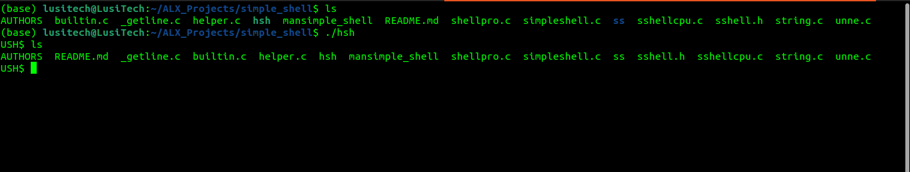

Simple Unix Shell
*****************************************************************
     C programming Language
******************************************************************

## Description:
    
Implementation of a basic shell. In Linux and other UNIX-based operating systems, the shell is an interactive interface through which users can run various commands and functions. Shells employ either a command-line interface or a graphical user interface, depending on a computer's purpose and specific task.

## Installation:

- clone the repository

     https://github.com/hamdani2020/simple_shell

- compile with

     gcc -Wall -Werror -Wextra -pedantic *.c -o tsh

## Example:

     ubuntu@ubuntu$ ./hsh     
     $ pwd
     /home/ubuntu/simple_shell
     $ /bin/pwd
     /home/ubuntu/simple_shell
     $ ls -la
     -rw-rw-r-- 1 vagrant vagrant  bytes <date> builtins.c
     -rw-rw-r-- 1 vagrant vagrant   bytes <date> shell.h

## Builtins commands:

     exit: exits a shell
     
     env: show/displays environment variables
     
## Special Features and some common linux features:

     Ctrl + C: To prevent the killing of the simple-shell
     
     Ctrl + D: exit the simple-shell
     mkdir: to create a directory

     
    
## WARNING:

The work is still in process, therefore many features like as aliases, piping, redirection, and so on are not yet accessible.

## Authors

* [**Alhassan Hamdani Gandi**](https://github.com/hamdani2020)
